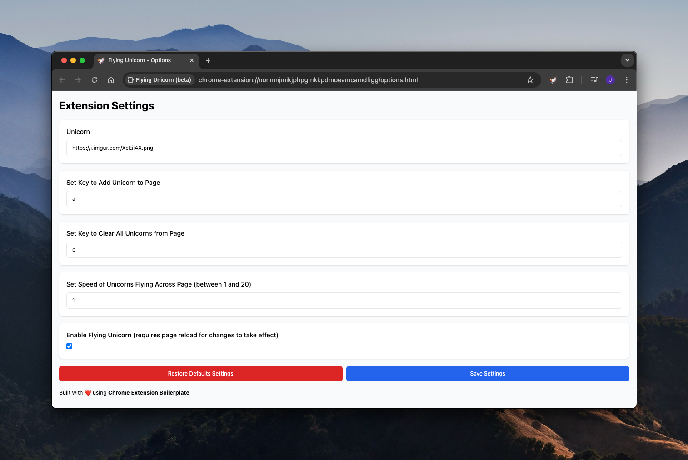

# Chrome Extension: Flying Unicorn

## Table of Contents

- [What does the Chrome Extension do?](#what-does-the-chrome-extension-do)
- [How to Use](#how-to-use)
- [Demo](#demo)
- [Install](#install)
- [Problems, Comments, Concerns, Improvements, Suggestions?](#problems-comments-concerns-improvements-suggestions)

## What does the Chrome Extension do?

We inject javascript and css to be able to insert a unicorn on the page, which handles on keypress events.

## How to Use

- Add a flying unicorn into the page: <kbd>U</kbd>
- Remove all unicorns from the page: <kbd>C</kbd>

## Demo

| Unicorn loaded into the page                                           | Extension Settings                                |
| ---------------------------------------------------------------------- | ------------------------------------------------- |
|  |  |

| Popup                                  | Extension Settings in Popup                                        |
| -------------------------------------- | ------------------------------------------------------------------ |
|  |  |

## Install

Install the Chrome Extension through the [Google Chrome Web Store](https://chrome.google.com/webstore/detail/flying-unicorn/cdedcjjdfckjnageanlcifalkpnjdbpg)

## Problems, Comments, Concerns, Improvements, Suggestions?

Please create an issue. I'll take a look and will update the extension when I can.
